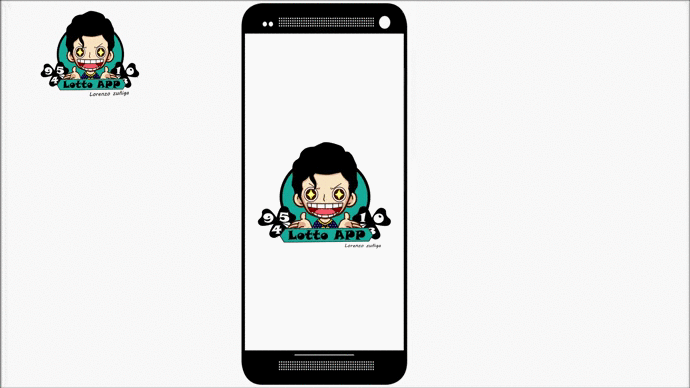

# Lotto-App
Aplicación Móvil para notificar y mostrar los diferentes resultados de la lotería en Costa Rica

# Desarrollada por Lorenzo Carazo

La aplicación fue desarrollada con Flutter/ Dart.
Dicha aplicación cuenta con el manejador de estados de GetX, es cual fue implementado para manejar la informormación en y la persintecia de los datos necesarios para el funcionamiento de la aplicación móvil.

se utiliza la inyección de dependecias y se utilizó la arquitectura propuesta por los desarrolladores del paquete manejodor de estados de Getx.

Link en la tienda:  https://n9.cl/want
